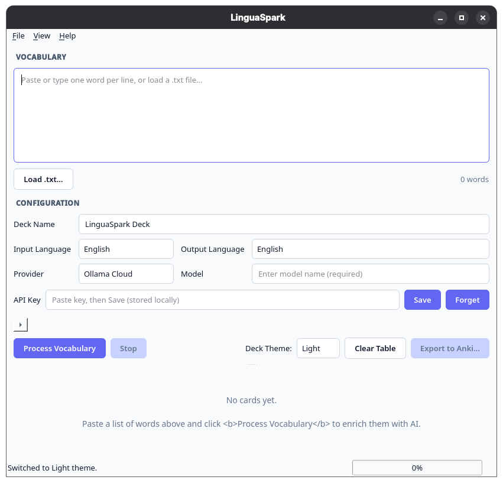
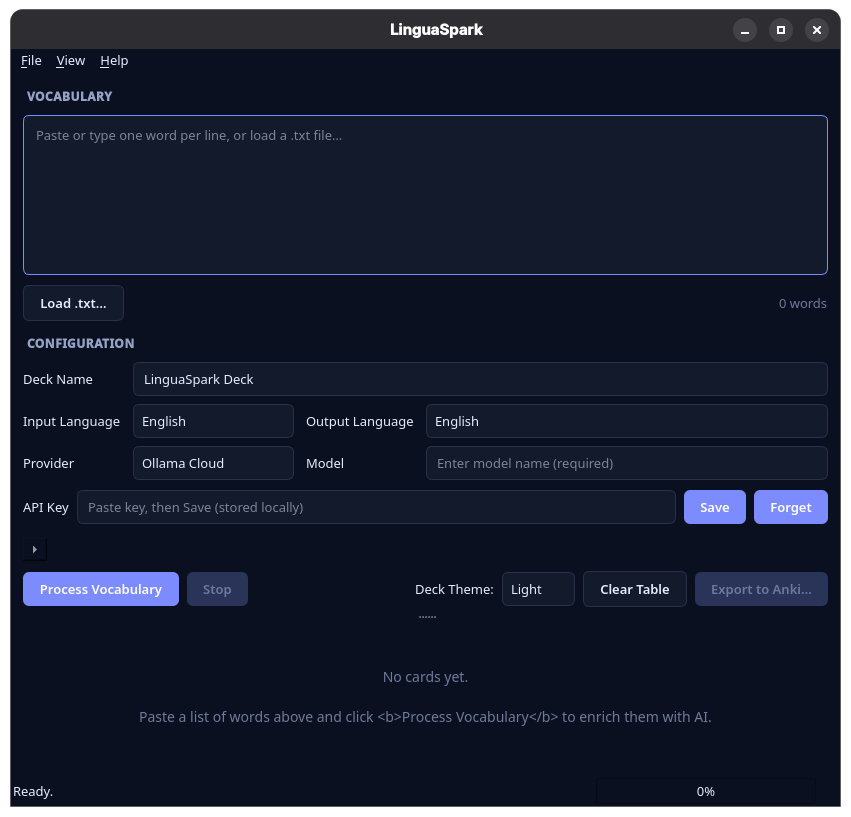
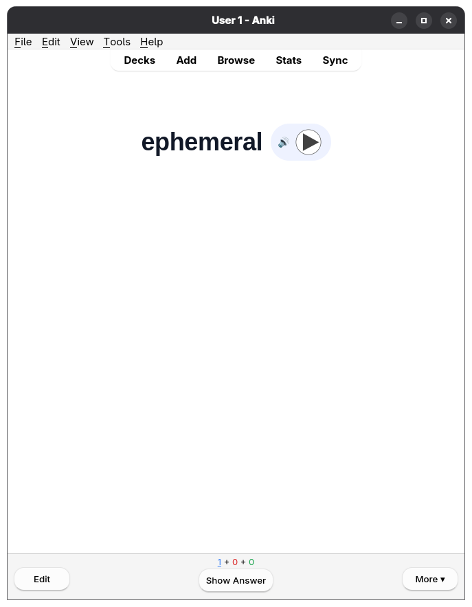
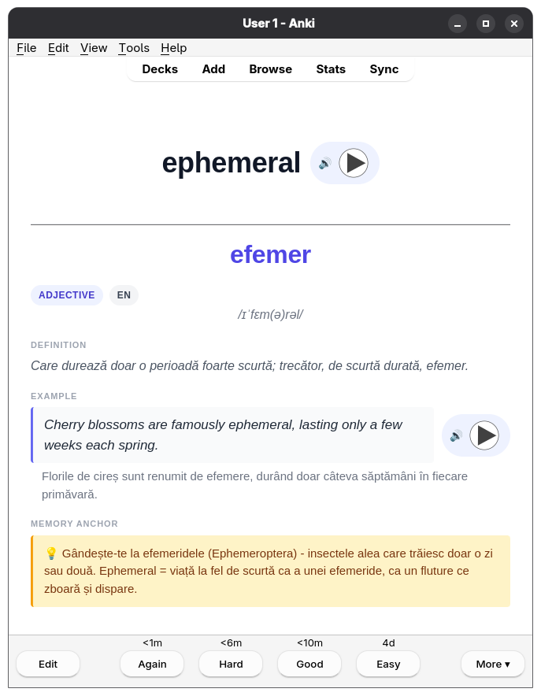

# LinguaSpark


**LinguaSpark** is an AI-powered Anki deck builder for Python. Paste a plain
list of words and a language model does the rest: definitions, phonetics,
example sentences, translations, and memory mnemonics — packaged into a
standard `.apkg` file ready for Anki, AnkiMobile, or AnkiWeb.

<table align="center">
  <tr>
    <td align="center">
      <strong>Dark Mode</strong><br>
        
    </td>
    <td align="center">
      <strong>Light Mode</strong><br>
      
    </td>
  </tr>
  <tr>
</table>

## Features

- **Zero-friction ingestion.** Paste words or load a `.txt` file, one term per
  line. No rigid formatting required.
- **Deep linguistic enrichment.** Each term gets a part of speech, target
  definition, IPA / native phonetics, a contextual example sentence with
  translation, and a vivid mnemonic.
- **Interactive review table.** Inspect and edit every card before exporting.
  Right-click a row to regenerate a single card or delete it.
- **Dual-engine flexibility.** Switch between hosted LLMs (OpenAI, Anthropic,
  Gemini) or run 100% offline with a local Ollama instance.
- **Native `.apkg` export.** Generates standard Anki packages with clean,
  modern card styling via `genanki`.

## Workflow

1. **Input** — type or paste a list of words into the input area.
2. **Configure** — set the deck name, the **input language** (for your
   words + the generated example sentences) and **output language** (for
   definitions, translations, and mnemonics on the back of each card),
   the AI provider, and the model.
3. **Enrich** — click **Process Vocabulary**. Cards stream into the table as
   they're generated; the UI stays responsive.
4. **Review** — tweak any field inline, right-click rows to regenerate or
   delete.
5. **Export** — click **Export to Anki** to write a `.apkg` file you can
   import directly into Anki.

## Installation

```bash
git clone https://github.com/andreipirone/Anki-Deck-Generator.git
cd Anki-Deck-Generator
pip install -r requirements.txt
```

**Runtime:** Python 3.9+ on Windows, macOS, or Linux.

## Usage

```bash
python main.py
```

On first launch:

1. Pick a provider from the dropdown. For cloud providers (OpenAI, Anthropic,
   Gemini), enter your API key and click **Save**. The key is stored locally
   in your OS user settings and auto-loaded on subsequent runs. Use **Forget**
   to remove it at any time.
2. For Ollama, make sure a local Ollama server is running
   (`ollama serve`) and that your desired model is pulled
   (`ollama pull llama3.1`). The default URL `http://localhost:11434` is
   pre-filled.
3. Paste your words, hit **Process Vocabulary**, review the table, then
   **Export to Anki**.

### Supported providers

LinguaSpark does **not** supply default model names per provider — you must
enter a model in the **Model** field before processing. This avoids silently
hitting an unexpected (and potentially costly) endpoint.

| Provider        | API key required | Example models                          |
|-----------------|------------------|------------------------------------------|
| OpenAI          | yes              | `gpt-4o-mini`, `gpt-4o`, `o1-mini`       |
| Anthropic       | yes              | `claude-3-5-sonnet-latest`, `claude-3-5-haiku-latest` |
| Gemini          | yes              | `gemini-1.5-flash`, `gemini-1.5-pro`     |
| Ollama (Local)  | no               | `llama3.1`, `mistral`, `qwen2.5:7b`      |
| Ollama Cloud    | yes              | `gemma3:cloud`, `gemma4:31b`             |

#### Ollama Cloud

For hosted Ollama models (no local install required):

1. Create an API key at <https://ollama.com/settings/keys>.
2. In LinguaSpark, select **Ollama Cloud** from the provider dropdown.
3. Paste your key, click **Save**.
4. Type any cloud model name into the **Model** field (browse the catalog at
   <https://ollama.com/search?c=cloud>). Requests go to
   `https://ollama.com/api/chat` with `Authorization: Bearer <key>`.

## Card template

<table align="center">
  <tr>
    <td align="center">
      <strong>Front of the card</strong><br>
        
    </td>
    <td align="center">
      <strong>Back of the card</strong><br>
      
    </td>
  </tr>
  <tr>
</table>

The card front shows the **term only**. The back reveals POS + language
badges, phonetics, **direct translation in the output language** (the
headline answer), and then — secondary — the definition, example +
translation, and a highlighted mnemonic callout. All back-of-card text
is written in the output language you select; the term + example
sentence are in the input language.


### Voice pronunciation (experimental)

> ⚠️ **Experimental.** Voice synthesis is powered by [Piper TTS](https://github.com/OHF-Voice/piper1-gpl)
> and depends on a user-supplied voice model. Not every model pronounces
> every text correctly (numbers, code-switching, and rare characters
> are common stumbling blocks). Audio files are embedded inside the
> `.apkg`, so the file size grows roughly proportionally to the number
> of cards (tens to hundreds of KB per card).

To enable voice pronunciation:

1. **Install Piper** (it's already a dependency in `requirements.txt`):
   ```bash
   pip install piper-tts
   ```
   On Windows you also need the Microsoft Visual C++ Redistributable.

2. **Download a voice** from the
   [piper-voices catalog](https://huggingface.co/rhasspy/piper-voices).
   Each voice is a pair of files: `<voice>.onnx` + `<voice>.onnx.json`.
   Put both in the same folder on your machine.

3. **In LinguaSpark**, open the *Advanced* section at the bottom of the
   input panel, tick **Enable voice pronunciation**, then click
   *Browse…* and select the `.onnx` file. LinguaSpark auto-discovers the
   sibling `.onnx.json`. Use *Test synthesize sample* to hear a sanity
   check immediately.

4. **Adjust parameters** (all optional):
   - **Speaker ID** — multi-speaker models offer several voices; 0 is the first.
   - **Length scale** — speech rate; 1.0 is normal, > 1.0 is slower.
   - **Noise scale / Noise W** — variation in prosody (0 = robotic, higher = more varied).

5. Click **Export to Anki**. Per-card synthesis runs during export and
   the resulting `.apkg` carries each term + example sentence as
   audio inside the deck.

**What gets spoken.** LinguaSpark records the term in the **input
language** (so learning French words is heard in French) plus the
example sentence in the same language. Output-language audio (e.g.
translations read aloud in English) is **not** generated — only one
uploaded voice is supported per export.

**Troubleshooting.**

- *Piper fails to load* — make sure the `.onnx.json` file lives next to the
  `.onnx`. The repo [rhasspy/piper-voices](https://huggingface.co/rhasspy/piper-voices)
  ships them as a pair.
- *Some cards have no audio in the .apkg* — the export will still succeed
  with a warning such as `audio for 47/50 cards`. Re-export after
  fixing the offending text or voice.
- *Synthesis is slow* — Piper runs on CPU by default (~1–3 s per
  card on a typical laptop). A CUDA build (`pip install onnxruntime-gpu`
  + `use_cuda=True`) is significantly faster but optional.

## Troubleshooting

- **"Model required"** — the Model field is empty. Enter the exact model
  name your provider expects (e.g. `gpt-4o-mini`, `gemma3:cloud`,
  `llama3.1`). LinguaSpark never auto-fills defaults.
- **"API key required"** — save a key for the selected provider. OpenAI,
  Anthropic, Gemini, and Ollama Cloud all require one; local Ollama does not.
- **Ollama (local) fails immediately** — confirm `ollama serve` is running and
  that your model is pulled (`ollama list`).
- **Ollama Cloud returns 401** — your key is invalid or expired; generate a
  new one at <https://ollama.com/settings/keys>.
- **JSON parse error from the LLM** — LinguaSpark retries once with a
  corrective message. If a word still fails it shows up as a row with a
  red error message; right-click → regenerate to retry.
- **"Piper voice missing" / "Piper load failed"** — enable voice
  pronunciation only after pointing the Advanced section at a valid
  `.onnx` file whose sibling `.onnx.json` lives next to it.
- **Export produces an empty deck** — your review table is empty; process
  some words first.

## License

MIT — see [LICENSE](LICENSE).

## Acknowledgments

- Built with [PySide6](https://wiki.qt.io/Qt_for_Python) (Qt for Python).
- Uses [genanki](https://github.com/kerrickstaley/genanki) for `.apkg` output.
- Anki is a trademark of Ankitects Pty Ltd.
